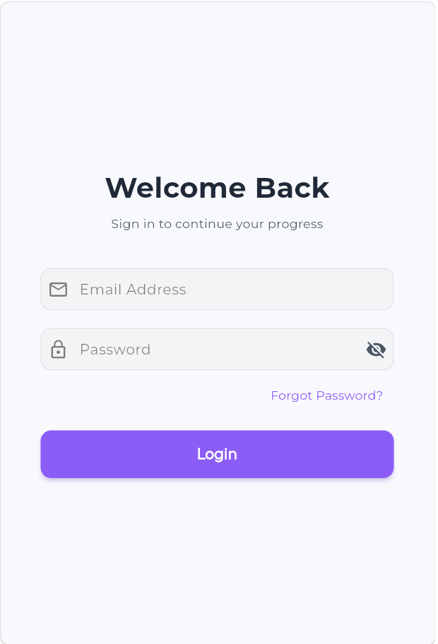
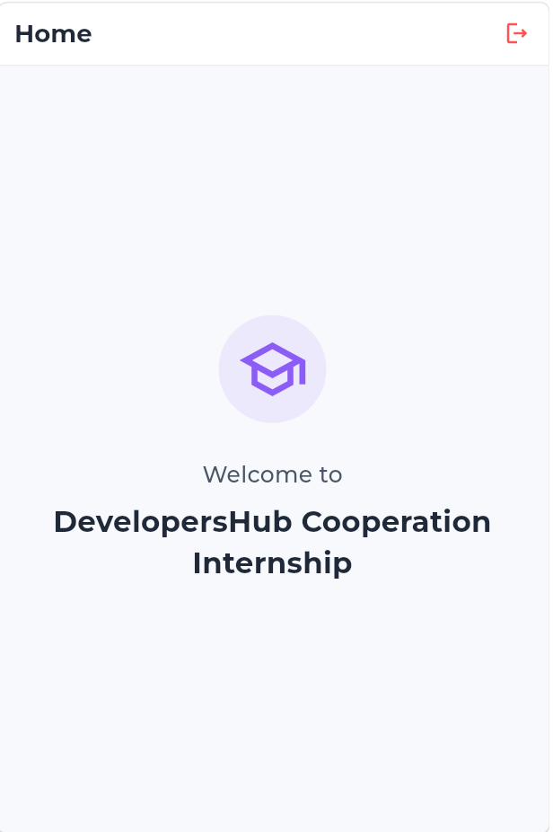

# Flutter Login & Dashboard App

A mobile-optimized Flutter application built for the DevelopersHub Corporation internship project. The app features a premium Light Theme, simple credentials authentication, and a dedicated welcome dashboard.

## Screenshots

| Login Screen | Welcome Home Screen |
| :---: | :---: |
|  |  |

## Features

- **Premium Light Theme**: Custom Light Theme using Google Fonts (Montserrat) with subtle borders, clean rounded card shapes, and soft color accents.
- **Mobile-Optimized Layout**: Centered credential cards with appropriate paddings and viewports for mobile screens.
- **Form Validations**: Real-time validation for email address format and password length requirements (minimum 6 characters).
- **Show/Hide Password**: Obscure text toggle button built into the password field.
- **Simulated Loading State**: Pressing "Login" triggers a 1.5-second loading indicator animation to simulate network requests.
- **Clean Welcome Screen**: Minimalist dashboard welcoming the user to the DevelopersHub Cooperation Internship, equipped with a top AppBar and logout actions.

## App Structure

- `lib/main.dart` - Application entry point configuring the global Material 3 light theme and Google Fonts.
- `lib/screens/login.dart` - Clean, centered credentials login page containing the validated email and password inputs.
- `lib/screens/home.dart` - Centered welcome landing screen featuring the logo icon, greeting, and logout systems.

## Getting Started

### Prerequisites

Make sure you have Flutter SDK installed. If not, follow the [Flutter Installation Guide](https://flutter.dev/docs/get-started/install).

### Run the Application

1. Clone or download this project folder.
2. Fetch the required dependencies:

```bash
flutter pub get
```

3. Launch the app on your connected mobile device, emulator, or browser:

```bash
flutter run
```
